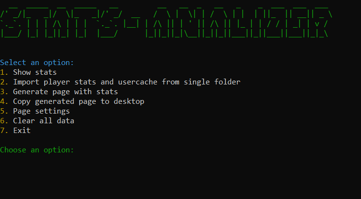

# Minecraft Stats Analyzer
This project aims to help you generate a summary of a minecraft server edition. It creates an HTML file that includes for example the top 10 best players of that edition. The page is generated statically, without requiring a connection to the server.

# Features
*(The appearance of the aplication.)*

**1.** Console Statistics Display You can choose a category, and then all relevant statistics (e.g., all mined blocks) will be displayed. Before using this feature, you must first import player statistics using the second function.

**2.** Importing Player Statistics This function allows you to import all statistics and user nickname information from a folder you create—just enter its path. (A detailed guide can be found in the How to Use section.)

**3.** Generating an HTML Report Creates an HTML page with all settings configured in option 5.

*(The appearance of the page in Polish language.)*

**4.** Copying the File to Desktop Copies the generated HTML file to the desktop and provides its path.

**5.** Configuration Options

*~Server-name (any text) – The name of the server for which statistics are generated.

~Report-name (filename.html) – The name of the generated HTML file.

~top_players_count (number) – Specifies the number of players to be included in the top list. This is particularly useful for large servers to avoid excessively long pages.

~dark_mode (True/False) – Enables dark mode for the generated page.

~language (pl/en) – Sets the language of the generated page to either Polish or English.

~show_stats – Allows enabling or disabling specific statistics on the page.*

**6.** Clearing Application Files Deletes all files from the application folder (useful if you want to generate statistics for another server).

**7.** Exit the Application Closes the program.

# How to use
**1.** Clone the repository using the following command:
`git clone https://github.com/XaromPL/Minecraft-Stats-Analyzer.git`

**2.** Install Python if you haven’t already, then download all required libraries using:
`pip install -r requirements.txt`

**3.** Access your Minecraft server folder using FTP or another method, then download the following files:

*All files from the world/stats folder*
*The usercache.json file from the main folder*

**4.** Create a new folder, move all downloaded files into it, and copy the folder path.

**5.** Open the command prompt, navigate to the downloaded repository folder using:
`cd folder/path`

**6.** Then run the application with:
`python main.py`

If you have any questions or suggestions on what can be changed or fixed, message me on Telegram 

# Disclaimer
*This program is an independent project and is not affiliated with, endorsed by, or officially supported by Mojang Studios or Microsoft*

# License: GNU GPL
This project is licensed under the GNU General Public License (GPL), ensuring that users have the freedom to run, study, modify, and distribute the software. The GPL enforces copyleft principles, meaning that any derivative work must also be open-source under the same license.

